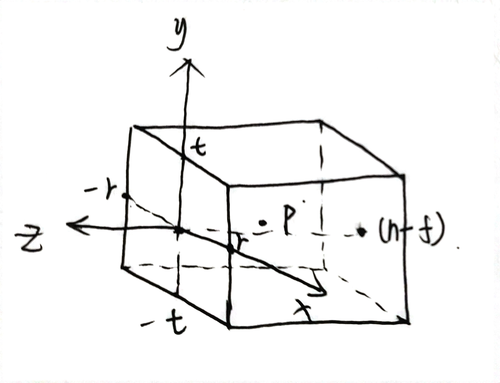
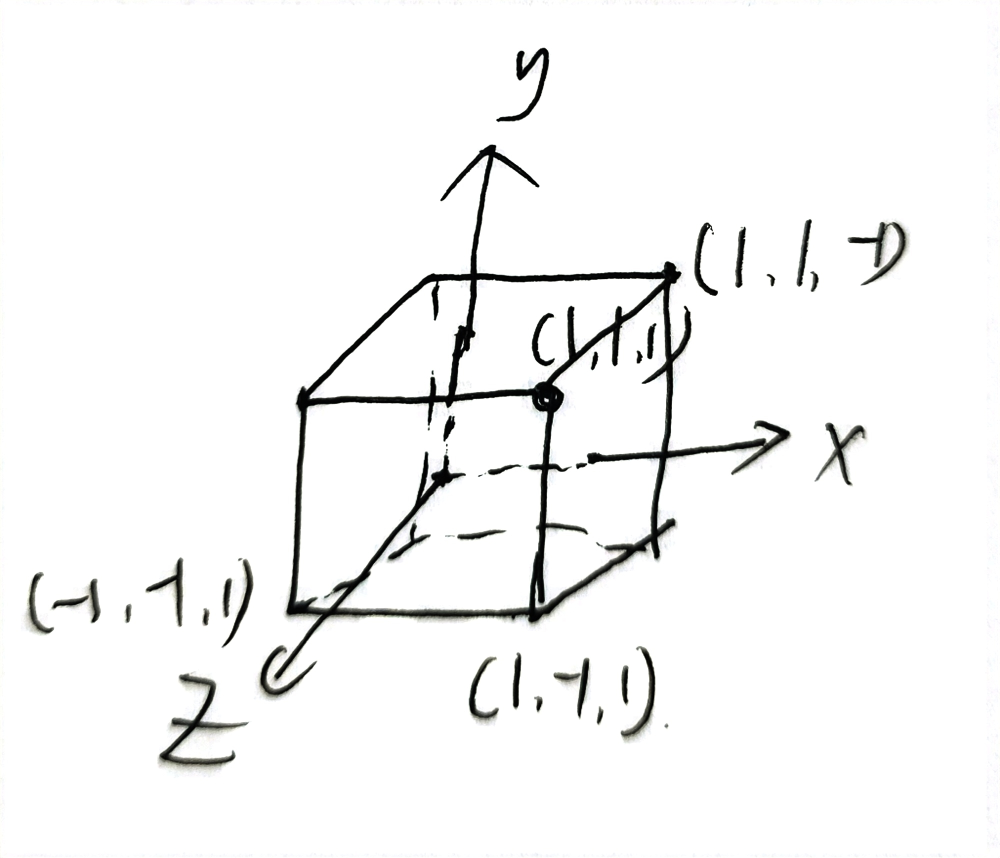
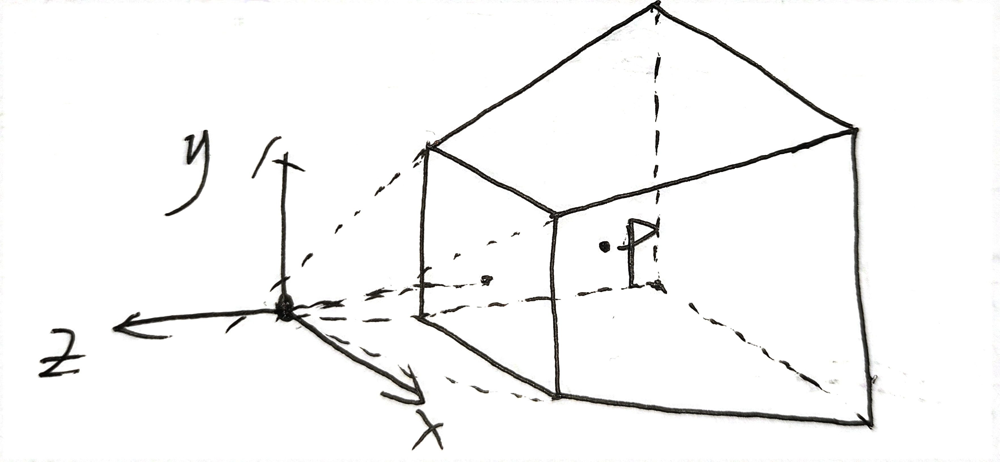
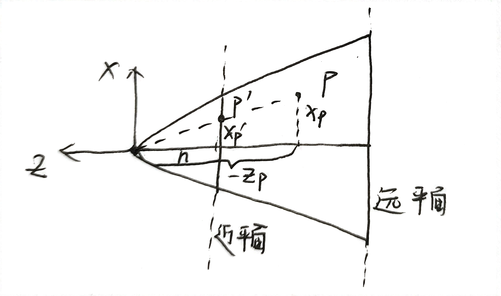

## 前言

本文主要目的是推导投影矩阵。曾经刚了解投影矩阵的时候，面对网上搜到的各种各样的推导非常头疼，因为他们推导前提条件和结果都不一样。本文会在非常明确的前提下推导出投影矩阵，并简略说明`Games 101`和`《Unity Shader入门精要》`中的投影矩阵的不同之处。

首先明确一点，推导投影矩阵时假设的前提条件不一样时（比如：视锥体位置、左手系或右手系、摄像机看向z轴正方向还是负方向、已知的参数等），推导出的结果会有所不同，。本文的推导过程**假设使用右手系，摄像机看向z轴负方向**，*已知的参数和视锥体位置另有说明*。

## 正交投影

首先假设`视锥体近平面`位于`z = 0`处，则`视锥体远平面`位于`z = n-f`处（z < 0），则

$$z\in[n - f,0]$$

假设近平面的中心位于坐标原点，设视锥体中x和y的取值范围如下：

$$x\in[-r, r],r > 0$$
$$y\in[-t, t],t > 0$$

在视锥体内有一点$P(x_p, y_p, z_p)$位于视锥体内，如下图所示。

我们的目标是将视锥体内任意一点$P$的坐标变换至$x,y,z\in[-1 ,1]$，变换后的示意图如下：

为了达到这个目的，我们需要将点P的$x, y, z$坐标分别进行缩放：

$$x_p' = \frac{1}{r}x_p$$
$$y_p' = \frac{1}{t}y_p$$
$$z_p' = \frac{2}{n - f}x_p - 1$$

则对应的矩阵为：

$$
\begin{bmatrix}
\frac{1}{r} & 0 & 0 & 0 \\\\
0 & \frac{1}{t} & 0 & 0 \\\\
0 & 0 & \frac{2}{n - f} & -1 \\\\
0 & 0 & 0 & 1
\end{bmatrix}
$$

在Unity中，我们一般使用另外的参数来描述正交相机，即：$t = size$， $aspect = r / t$，则$r = t \cdot aspect$，于是投影矩阵可以表示为：

$$
\begin{bmatrix}
\frac{1}{aspect\cdot t} & 0 & 0 & 0 \\\\
0 & \frac{1}{size} & 0 & 0 \\\\
0 & 0 & \frac{2}{n - f} & -1 \\\\
0 & 0 & 0 & 1
\end{bmatrix}
\tag*{正交投影矩阵一}
$$

注意，这个正交投影矩阵与`Games 101`和`《Unity Shader入门精要》`中的正交投影矩阵都不相同。

与本节的假设相比，`《Unity Shader入门精要》第81页`中的正交投影矩阵假设原始视锥体的近平面并没有位于$z=0$处，而是位于$z=-n$处，**即对于原始视锥体中的任意一点，$z\in[-f, -n]$**，其正交投影矩阵如下：

$$
\begin{bmatrix}
\frac{1}{aspect\cdot size} & 0 & 0 & 0 \\\\
0 & \frac{1}{size} & 0 & 0 \\\\
0 & 0 & \frac{2}{n - f} & \frac{n + f}{n - f} \\\\
0 & 0 & 0 & 1
\end{bmatrix}
\tag*{正交投影矩阵二}
$$

与本节的假设相比，`Games 101`中的投影矩阵的推导，假设视锥体位于任何位置（但视锥体始终与坐标轴平行），具体推导可以见:[GAMES101-现代计算机图形学入门-闫令琪](https://www.bilibili.com/video/BV1X7411F744/?p=4&share_source=copy_web&vd_source=77b46b29f4f7cb5d443b63654b67194a)

## 透视投影

对于透视投影，其视锥体为一个平截头体（frustum），我们先考虑将其"压缩"，即保持近平面不变，将其"压缩"为一个立方体，然后利用透视投影的方法得到结果。

假设平截头体所在四棱锥的顶尖位于坐标原点，朝向z轴负方向，并且关于x轴和y轴对称，有一点$P(x_p, y_p, z_p)$位于视锥体内，如下图所示：

首先考虑点$P$的坐标$x_p$，我们从下往上去看（或者从上往下看，一样的），如下图所示：

则可以很容易的由相似三角形得到变换后的坐标

$$x_p' = \frac{n}{-z_p}x_p$$

同理可得（懒得画图了）：

$$y_p' = \frac{n}{-z_p}y_p$$

我们暂时先不处理$z_p'$。由于式子中含有$-z_p$，无法直接写在矩阵当中，所以接下来需要经过一些特别的处理。我们知道，对于齐次坐标：

$$
\begin{bmatrix}
x_p\\\\
y_p \\\\
z_p \\\\
1
\end{bmatrix}
和
\begin{bmatrix}
nx_p\\\\
ny_p \\\\
nz_p \\\\
n
\end{bmatrix}
$$

这两个齐次坐标表示三维空间中的同一个点。如果我们某一次计算的结果是后一种，则"隐含了"接下来要除以n的操作。因此我们得到如下矩阵：

$
\begin{bmatrix}
n & 0 & 0 & 0 \\\\
0 & n & 0 & 0 \\\\
? & ? & ? & ? \\\\
0 & 0 & -1 & 0
\end{bmatrix}
$*$
\begin{bmatrix}
x_p\\\\
y_p \\\\
z_p \\\\
1
\end{bmatrix}
$=$
\begin{bmatrix}
nx_p\\\\
ny_p \\\\
? \\\\
-z_p
\end{bmatrix}
$

这个矩阵已经可以完美描述$x_p$和$x_p$的变换了，对于$z_p$，我们无法简单的找到公式，但是我们发现对于近平面和远平面内的点，变换后的$z_p' = z_p$，而位于视锥体内部的点则不一定。并且$z_p'$与$x_p$和$y_p$无关，于是我们可以根据近平面和远平面上的点列出式子。

对于近平面，其$z_p = -n$：

$
\begin{bmatrix}
n & 0 & 0 & 0 \\\\
0 & n & 0 & 0 \\\\
0 & 0 & A & B \\\\
0 & 0 & -1 & 0
\end{bmatrix}
$ * $
\begin{bmatrix}
x_p\\\\
y_p \\\\
-n \\\\
1
\end{bmatrix}$ = $
\begin{bmatrix}
nx_p\\\\
ny_p \\\\
-n^2 \\\\
n
\end{bmatrix}$ ,即：$
[0, 0, A, B]$ * $
\begin{bmatrix}
x_p\\\\
y_p \\\\
-n \\\\
1
\end{bmatrix}$ = $
-n^2
$

对于远平面，其$z_p = -f$

$
\begin{bmatrix}
n & 0 & 0 & 0 \\\\
0 & n & 0 & 0 \\\\
0 & 0 & A & B \\\\
0 & 0 & -1 & 0
\end{bmatrix}
$ * $
\begin{bmatrix}
x_p\\\\
y_p \\\\
-f \\\\
1
\end{bmatrix}$ = $
\begin{bmatrix}
nx_p\\\\
ny_p \\\\
-f^2 \\\\
f
\end{bmatrix} $ ,即：$
[0, 0, A, B] $ * $
\begin{bmatrix}
x_p\\\\
y_p \\\\
-f \\\\
1
\end{bmatrix}$ = $
-f^2
$

解这个方程组即可得到：

$$A=n+f$$

$$B=nf$$

$B$的值与`Games 101`中推导出的值$（B=-nf）$不同（大概是因为他们假设$z\in[n, f]$，与我们的假设不同）。

于是可得矩阵

$$
\begin{bmatrix}
n & 0 & 0 & 0 \\\\
0 & n & 0 & 0 \\\\
0 & 0 & n+f & nf \\\\
0 & 0 & -1 & 0
\end{bmatrix}
\tag*{透视投影矩阵一}
$$

经过`透视投影矩阵一`投影后，原视锥体由平截头体变为一个立方体，坐标取值范围为$x\in[-r, r]$，$y\in[-t, t]$，$z\in[-f, -n]$，再次对其应用`正交投影矩阵二`:

$
\begin{bmatrix}
\frac{1}{aspect\cdot size} & 0 & 0 & 0 \\\\
0 & \frac{1}{size} & 0 & 0 \\\\
0 & 0 & \frac{2}{n - f} & \frac{n + f}{n - f} \\\\
0 & 0 & 0 & 1
\end{bmatrix}$ * $
\begin{bmatrix}
n & 0 & 0 & 0 \\\\
0 & n & 0 & 0 \\\\
0 & 0 & n+f & nf \\\\
0 & 0 & -1 & 0
\end{bmatrix} $ =
$$ 
\begin{bmatrix}
\frac{n}{aspect\cdot size} & 0 & 0 & 0 \\\\
0 & \frac{n}{size} & 0 & 0 \\\\
0 & 0 & \frac{n+f}{n - f} & \frac{2nf}{n-f} \\\\
0 & 0 & -1 & 0
\end{bmatrix} \tag*{透视投影矩阵二}
$$

接下来是换参数的问题。在Unity中，透视相机由$aspect$、$fov$、$near(n)$和$far(f)$定义

$$ \cot\frac{fov}{2} = \frac{n}{size}$$

所以最终的透视投影矩阵可以写为

$$
\begin{bmatrix}
\frac{\cot\frac{fov}{2}}{aspect} & 0 & 0 & 0 \\\\
0 & \cot\frac{fov}{2} & 0 & 0 \\\\
0 & 0 & \frac{n+f}{n - f} & \frac{2nf}{n-f} \\\\
0 & 0 & -1 & 0
\end{bmatrix}
\tag*{透视投影矩阵三}
$$

`透视投影矩阵三`与`《Unity Shader入门精要》第79页`的矩阵相同。
